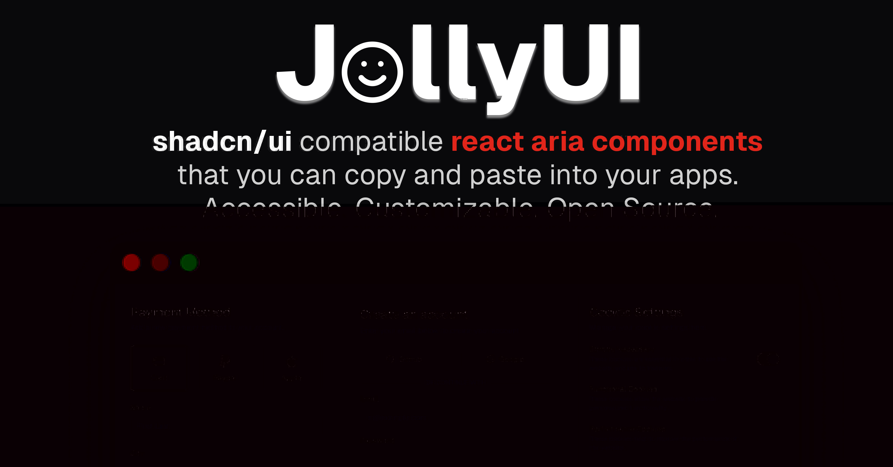

# JollyUI

[shadcn/ui](https://ui.shadcn.com/) compatible [react aria components](https://react-spectrum.adobe.com/react-aria/index.html) that you can copy and paste into your apps. Accessible. Customizable. Open Source.

## Documentation

Visit https://jollyui.dev/docs to view the documentation.

## Contributing

Please read the [contributing guide](/CONTRIBUTING.md).

## License

Licensed under the [MIT license](https://github.com/shadcn/ui/blob/main/LICENSE.md).

## Contributors

<!-- ALL-CONTRIBUTORS-LIST:START - Do not remove or modify this section -->
<!-- prettier-ignore-start -->
<!-- markdownlint-disable -->
<table>
  <tbody>
    <tr>
      <td align="center" valign="top" width="14.28%"><a href="http://jamesshopland.com"> <b>James Shopland</b></a> <a href="#doc-jolbol1" title="Documentation">📖</a> <a href="#code-jolbol1" title="Code">💻</a> <a href="#design-jolbol1" title="Design">🎨</a></td>
      <td align="center" valign="top" width="14.28%"><a href="https://github.com/GregorGabric"> <b>Gregor Gabrič</b></a> <a href="#doc-GregorGabric" title="Documentation">📖</a></td>
      <td align="center" valign="top" width="14.28%"><a href="https://github.com/Lorde4Avalon"> <b>Lorde</b></a> <a href="#doc-Lorde4Avalon" title="Documentation">📖</a></td>
      <td align="center" valign="top" width="14.28%"><a href="https://github.com/nxsdev"> <b>noxis</b></a> <a href="#design-nxsdev" title="Design">🎨</a></td>
      <td align="center" valign="top" width="14.28%"><a href="https://github.com/saeidex"> <b>EK Nayeem</b></a> <a href="#doc-saeidex" title="Documentation">📖</a></td>
      <td align="center" valign="top" width="14.28%"><a href="https://github.com/alecmev"> <b>Alec Mev</b></a> <a href="#design-alecmev" title="Design">🎨</a></td>
    </tr>
  </tbody>
</table>

<!-- markdownlint-restore -->
<!-- prettier-ignore-end -->

<!-- ALL-CONTRIBUTORS-LIST:END -->
