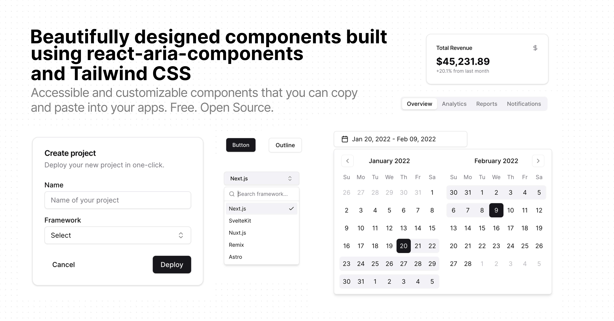

# JollyUI

[shadcn/ui](https://ui.shadcn.com/) compatible [react aria components](https://react-spectrum.adobe.com/react-aria/index.html) that you can copy and paste into your apps. Accessible. Customizable. Open Source.

## Documentation

Visit https://jollyui.dev/docs to view the documentation.

## Contributing

Please read the [contributing guide](/CONTRIBUTING.md).

## License

Licensed under the [MIT license](https://github.com/shadcn/ui/blob/main/LICENSE.md).
